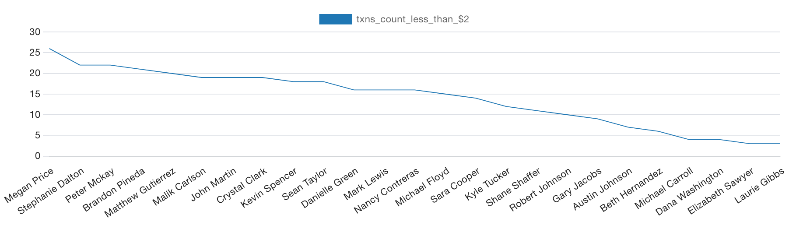
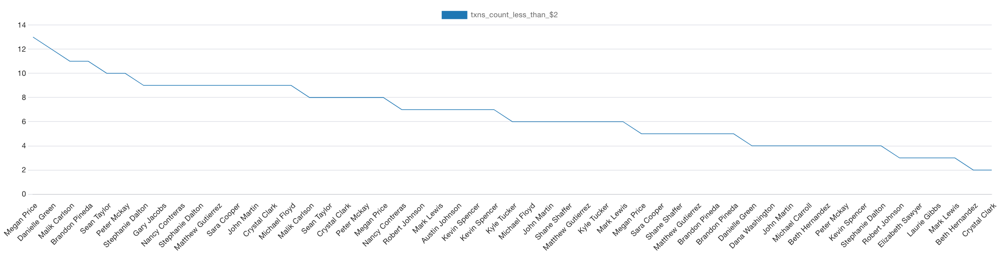
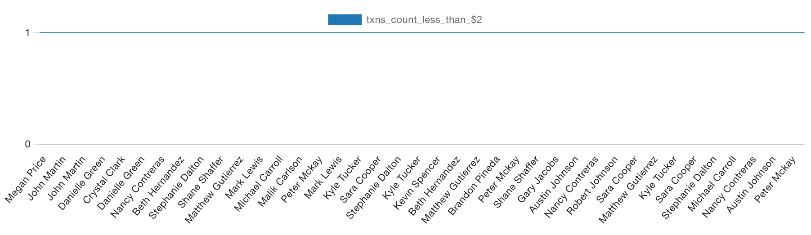
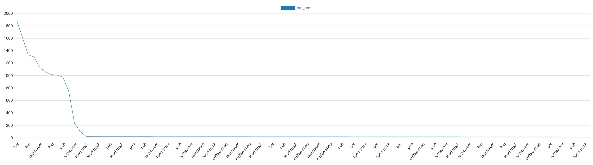
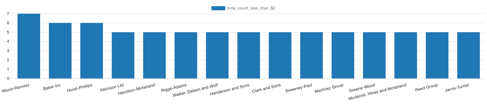

# sql-challenge
Module 7 SQL challenge using newfound skills to analyze historical credit card transactions and consumption patterns to identify possible fraudulent transactions.

# Columbia Engineering FinTech Bootcamp 2023-06

> Project: Module 7 SQL challenge assignment

> Purpose: In this activity, we used our newfound SQL and Python skills to analyze historical credit card transactions and consumption patterns with the goal of identifying possible fraudulent transactions.

## Data Analysis Report

### <u>Part 1</u>

- Some fraudsters hack a credit card by making several small transactions (generally less than $2.00), which are typically ignored by cardholders.

    - How can you isolate (or group) the transactions of each cardholder?
    
        `We can create an SQL select query where we group on cardholder_id and cardholder name,and count the number of credit card transactions by carhdolder that are less than $2 each.  As a result, we observed many cardholders with numerous transactions less than $2 each, and therefore further refined and investigated the grouping in the following two ways:

        1. Because each cardholder (defined by cardholder_id along with associated cardholder name) could hold more than one credit card, we added credit card number to the grouping to investigate whether there were any particular card(s) potentially associated with fraud.  This reflected our belief that consumer fraud can occur on multiple levels, including both general identify theft and cases of invdividual credit card theft, e.g. gas station and retail outlets card skimming.
        
        2. We added transaction grouping by date to the 1-year period covered by the data to investigate whether there were small transaction spikes on any given day associated with the cardholder.

    - Count the transactions that are less than $2.00 per cardholder.
        
        `Over the 2018 transaction period of 1 year, we observed the following number of transactions below $2 by cardholder:`

        

        `Over the 2018 transaction period, we observed the following number of transactions below $2 by cardholder credit card:`

        

        `On days when a transaction was made, we did not observe any cardholder with more than one transaction per day below $2:`

        

    - Is there any evidence to suggest that a credit card has been hacked? Explain your rationale.

        `While we don't see any unusual spikes in small transactions on a daily basis, over the one year period we do see ten or more small transactions for six credit cards associated with six different cardholders, and which may be worthy of further investigation.  There are a further 47 credit cards associated with small transactions over the year ranging in count from 2 to 9, which may also be associated with fraud, but may also be legitimate small transactions such as coffee, parking meters, and convenience store items.`

- Take your investigation a step further by considering the time period in which potentially fraudulent transactions are made.

    - What are the top 100 highest transactions made between 7:00 am and 9:00 am?

        `This question was initially confusing.  But ultimately interpreted as meaning the top 100 'largest' transactions, as 'highest' in contrast connoted frequency which was tested and didn't comport with or make sense within our use of the SQL 'LIMIT 100' transactions condition.  The top 100 largest indvidual transactions between 7 am and 9 am were characterized by bar and pub activity dominating the top 5 transactions, as illustrated below:`

        

        `We interpret this investigation so far as exploring a) small transactions less than $2 each, which are more likely than other transactions to go undetected by the cardholder throughout the day, regardless of the time of day; and b) separately this latest step to explore all transaction types and amounts that occur within a limited timeframe, 7 am - 9 am, before many cardholders have started their busy days legitimately transacting normal business, we interpret as another opportunity for fraudulent activity to go undetected by cardholders, regardless of transaction size.`

    - Do you see any anomalous transactions that could be fraudulent?

        `We see unusual and unexpected bar and pub activity, both in terms of the type of activity and the size of the individual transaction amount, occurring between 7 am and 9 am.  These were individual transactions, as we looked at the top 100 transaction amounts by transaction_id, reflected in the above aforementioned graph.`

    - Is there a higher number of fraudulent transactions made during this time frame versus the rest of the day?

    - If you answered yes to the previous question, explain why you think there might be fraudulent transactions during this time frame.

- What are the top 5 merchants prone to being hacked using small transactions?

    `Small transactions of 5 or more were observed across 15 merchants.  Of these 15 merchants, 5 were associated with bars and pubs: Wood-Ramirez (7 transactions), Hood-Phillips (6), Atkinson Ltd (5), Greene-Wood (5), and Jarvis-Turner (5).  Top small transaction merchants are shown below where 5 or more small transactions were observed.  Note a number of merchants tied with 5 transactions, and there order appears below based on transaction date and time:`

    

- Create a view for each of your queries.

    `Views created:`
    - Cardholder small transactions: `cardholder_small_cc_txns_aggregate_frequency`
    - Cardholder credit card small transactions: `cardholder_credit_card_small_txns_aggregate_frequency`
    - Cardholder small daily transactions: `cardholder_small_cc_txns_daily_frequency`
    - Cardholder credit card small daily transactions: `cardholder_credit_card_small_txns_daily_frequency`
    - 100 Largest individual credit card transactions 7 am - 9 am: `top_100_largest_txns_7am_9am`
    - Top 5+ Merchants prone to small transactions: `top_merchants_prone_to_small_txns_aggregate_frequency`

### <u>Part 2</U>

- The two most important customers of the firm may have been hacked. Verify if there are any fraudulent transactions in their history. For privacy reasons, you only know that their cardholder IDs are 2 and 18.

    - Using hvPlot, create a line plot representing the time series of transactions over the course of the year for each cardholder separately.

    - Next, to better compare their patterns, create a single line plot that contains both card holders' trend data.
    
    - What difference do you observe between the consumption patterns? Does the difference suggest a fraudulent transaction? Explain your rationale.

- The CEO of the biggest customer of the firm suspects that someone has used her corporate credit card without authorization in the first quarter of 2018 to pay quite expensive restaurant bills. Again, for privacy reasons, you know only that the cardholder ID in question is 25.

    - Using hvPlot, create a box plot, representing the expenditure data from January 2018 to June 2018 for cardholder ID 25.

    - Are there any outliers for cardholder ID 25? How many outliers are there per month?

    - Do you notice any anomalies? Describe your observations and conclusions.
